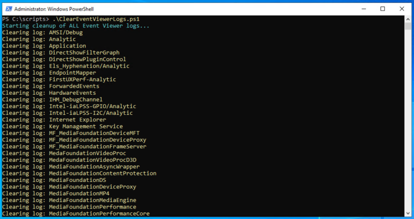
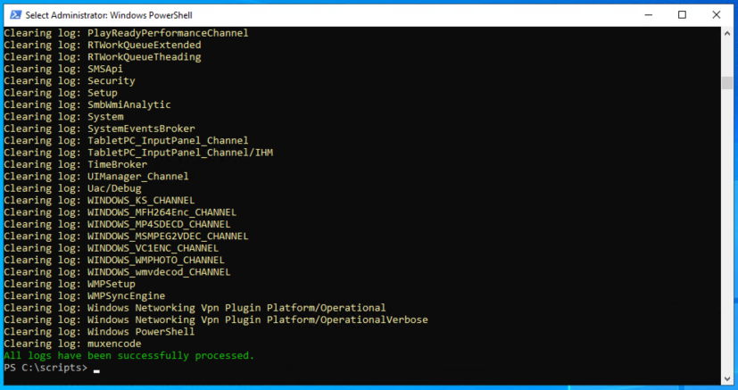

# Clear Event Viewer Logs
Clear all Windows Server or Desktop logs.

The script does not record, create or modify anything in the Windows.
 

### How to run:

Just copy or download the ClearEventViewerLogs.ps1 and run on any computer or server that meets the requirements below.

### Requirements:

The script must be run with the following requirements:

 - Must be run with administrator rights to clear all logs

## Screenshots:

  
  
